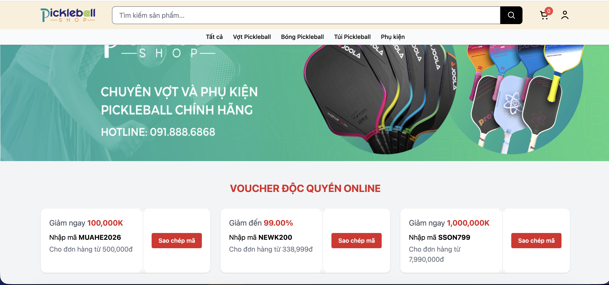
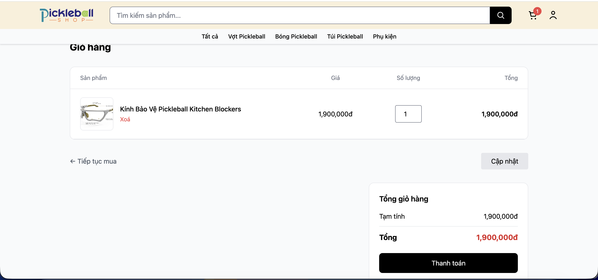
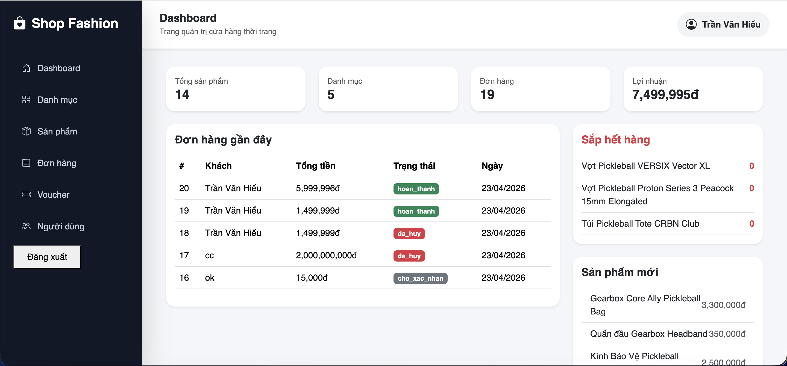

# 🛍️ Website Bán đồ thể thao Pickleball (Laravel)

## 📌 Giới thiệu

Đây là dự án website bán đồ thể thao Pickleball được xây dựng bằng **Laravel**.

### ✨ Hệ thống hỗ trợ:

- Quản lý sản phẩm, danh mục
- Giỏ hàng, thanh toán
- Voucher giảm giá
- Dashboard thống kê cho admin

---

## 🚀 Công nghệ sử dụng

- **Backend:** Laravel (PHP)
- **Frontend:** Blade + TailwindCSS + Bootstrap
- **Database:** MySQL
- **Authentication:** Laravel Auth (custom)
- **Session:** Giỏ hàng lưu bằng session

## 📸 Demo giao diện

### 🏠 Trang chủ



### 🛒 Giỏ hàng



### 🛠️ Admin Dashboard

## 

## 🧩 Chức năng chính

### 👤 Người dùng (Client)

- Đăng ký / Đăng nhập
- Xem danh sách & chi tiết sản phẩm
- Thêm vào giỏ hàng
- Cập nhật số lượng
- Thanh toán đơn hàng
- Áp dụng voucher
- Sao chép mã voucher

---

### 🛒 Giỏ hàng

- Lưu bằng session
- Cập nhật số lượng sản phẩm
- Kiểm tra tồn kho khi cập nhật
- Tính tổng tiền realtime

---

### 💳 Thanh toán

- Nhập thông tin nhận hàng
- Tạo Order + OrderItem
- Trừ số lượng sản phẩm trong kho
- Sử dụng **Database Transaction** để tránh lỗi

---

### 🎟️ Voucher

- Giảm theo % hoặc số tiền
- Có điều kiện đơn tối thiểu

---

### 🛠️ Admin Dashboard

- Tổng sản phẩm
- Tổng danh mục
- Tổng đơn hàng
- Lợi nhuận

👉 Công thức:

```
Lợi nhuận = (Giá bán - Giá nhập) * số lượng - voucher
```

---

### 📊 Thống kê

- Đơn hàng gần đây
- Sản phẩm mới
- Sản phẩm sắp hết hàng (stock < 5)

---

## 🗂️ Cấu trúc project

```
app/
├── Http/
│   ├── Controllers/
│   │   ├── Client/              # Logic phía người dùng
│   │   │   ├── CartController.php
│   │   │   │   - Quản lý giỏ hàng (session)
│   │   │   │   - Thêm / sửa / xoá sản phẩm
│   │   │   │   - Kiểm tra tồn kho
│   │   │   │
│   │   │   ├── CheckoutController.php
│   │   │   │   - Xử lý thanh toán
│   │   │   │   - Tạo Order + OrderItem
│   │   │   │   - Trừ stock
│   │   │   │   - Transaction
│   │   │   │
│   │   │   └── AuthController.php
│   │   │       - Đăng nhập / đăng ký
│   │   │       - Bảo mật session
│   │   │
│   │   └── DashboardController.php   # Admin
│   │       - Thống kê
│   │       - Tính lợi nhuận
│   │       - Sản phẩm sắp hết hàng
│
├── Models/
│   ├── Product.php
│   │   - price, cost_price, stock
│   │
│   ├── Order.php
│   │   - Đơn hàng (hasMany OrderItem)
│   │
│   ├── OrderItem.php
│   │   - Snapshot sản phẩm khi mua
│   │
│   └── Voucher.php
│       - Mã giảm giá
│
resources/
├── views/
│   ├── client/                 # Giao diện user
│   │   - Home, Product, Cart, Checkout
│   │
│   └── dashboard.blade.php    # Giao diện admin
```

---

## ⚙️ Cài đặt

### 1. Clone project

```bash
git clone <repo-url>
cd project
```

### 2. Cài đặt package

```bash
composer install
npm install
```

### 3. Cấu hình môi trường

```bash
cp .env.example .env
php artisan key:generate
```

### 4. Cấu hình database (.env)

```
DB_DATABASE=shop_fashion
DB_USERNAME=root
DB_PASSWORD=
```

### 5. Chạy migrate

```bash
php artisan migrate
```

### 6. Chạy server

```bash
composer run dev
```

---

## 🔐 Phân quyền

- **Admin:** Quản lý hệ thống
- **User:** Mua hàng

Middleware:

```
auth
admin
```

---

## ⚠️ Các vấn đề đã xử lý

- ✔️ Kiểm tra tồn kho khi thêm/cập nhật giỏ hàng
- ✔️ Transaction khi checkout
- ✔️ Fix lỗi route admin
- ✔️ Fix overflow `total_price`
- ✔️ Fix logic tính lợi nhuận

---

## 💡 Hướng phát triển

- Thanh toán online (VNPay, Momo)
- Biểu đồ thống kê (Chart.js)
- Realtime stock
- Wishlist
- Đánh giá sản phẩm

---

## 📄 License

Dự án phục vụ mục đích học tập.
